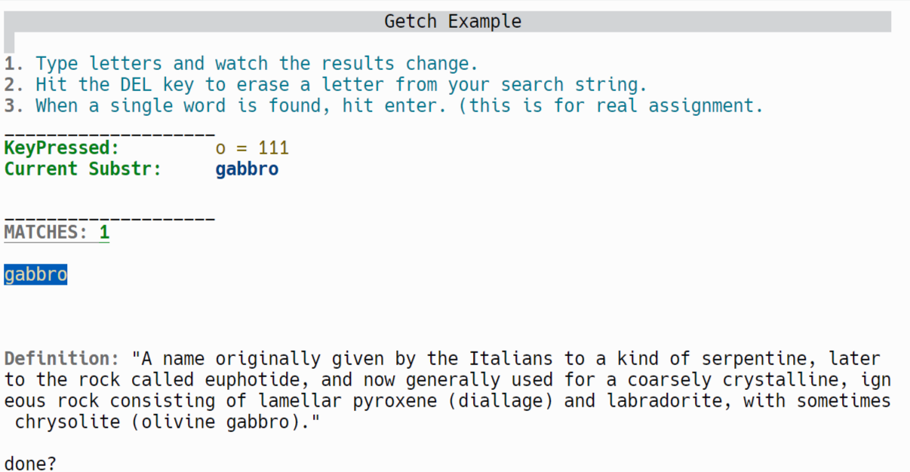
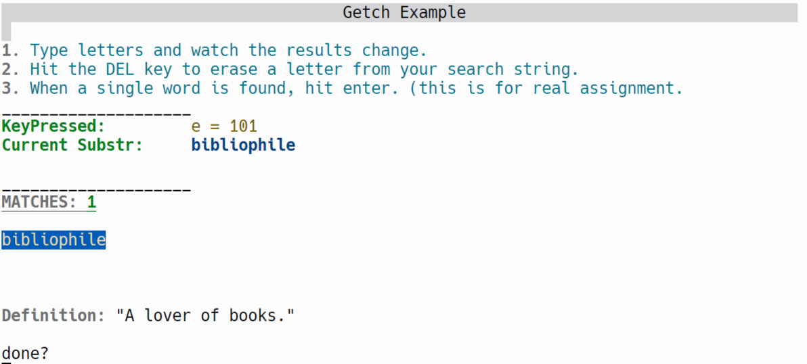
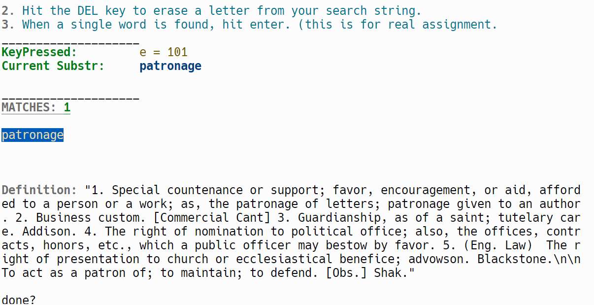
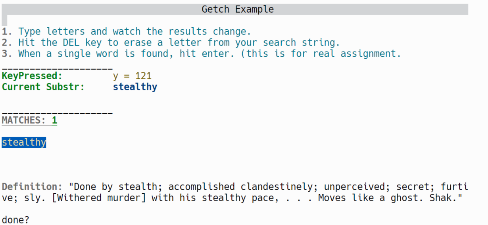

# P02 - Linear Search - Using Json and Getc
Caitlin Allison
 
This programs imports a json file called dictionary into a vector of strings. The program then prompts the user to type in a word they are looking for and the program will respond with the first 10 matching words to the current input. After the word has been found and the user hits enter, the program will end.
 
***
## Files
|   Name   | Folder Link | Des |
| :---: | ----------- | --------------- |
|  main    | [main](./main.cpp) | The source code |
| dictionary | [dictionary](./input/dictionary.json) | Input file |
| console | [console.hpp](./headers/console.hpp) | Controls console display |
| json | [json.hpp](./headers/json.hpp) | Allows json types |
| rang | [rang.hpp](./headers/rang.hpp) | Color and Formatting |
***
## Instructions
- Requires C++ version 20
- Input character keys into the console window until only one match remains
- To end the program press the enter key twice.
## Example Command

